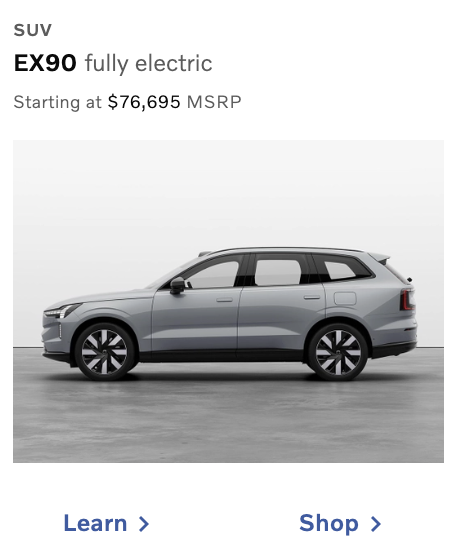
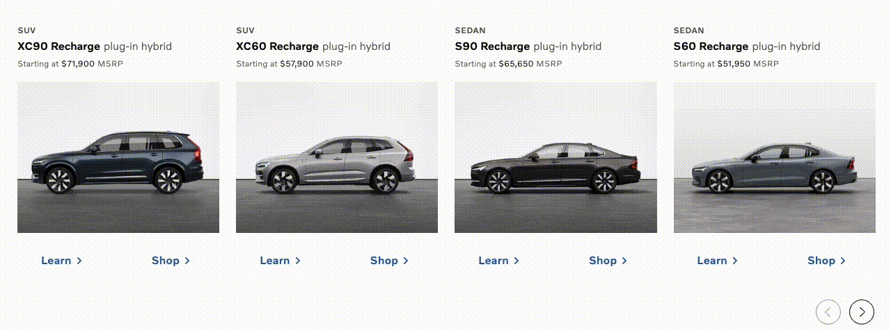
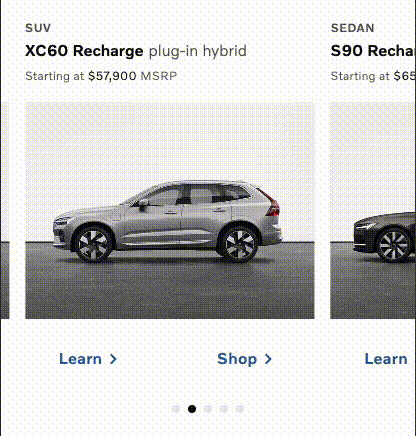

# Next.js Reel Component

## Task description

Your task is to implement:

- Data fetching for a reel component using Next.js 14's App Router
- `ProductListReelFrame` component
- Arrow buttons to scroll the reel left and right which reside in the `ProductListReel` component
- Unit tests using a testing library of your choice

## Notes

- Try to implement as many of the requirements as possible within the time frame.
- Try to focus on achieving the base functionality first, followed by what parts you feel is most important for good quality code.
- Submit the test even if not all task are fully finished.

## ProductListReelFrame component

- Styled to match the [provided design](#product-list-frame)
- Every frame should link to its respective car model page `/cars/model-name`
- The frame should display the car model name and image
- The "Learn" and "Shop" links should be present and link to `/learn/model-name` and `/shop/model-name` respectively

## Requirements

- Accessibility is important.
- Code Structure and reusability is important.
- Use Volvo Cars design system - [link](https://developer.volvocars.com/design-system/web/?path=/docs/getting-started-1-introduction--docs)
- The data required to render the design should be fetched by the application from [here](https://codility.blob.core.windows.net/tests/volvo-cars-frontend-nextjs-reel-cars.json) and looks like this:

```json
[
  {
    "id": "xc90-recharge",
    "modelName": "XC90 Recharge",
    "bodyType": "suv",
    "modelType": "plug-in hybrid",
    "imageUrl": "/images/xc90_recharge.jpg",
    "price": "491,000"
  },
  ...
]
```

## Assumptions

- Browser support is modern ever-green browsers.

## Examples of the reel component

### Product List Frame



### Desktop version



### Mobile version


